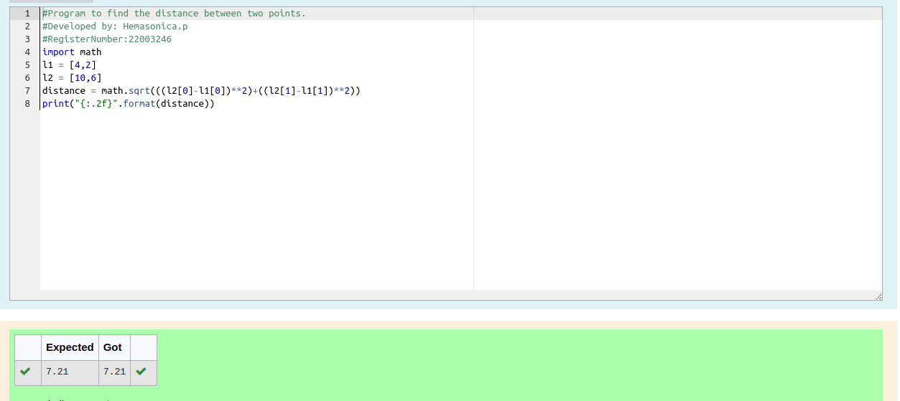

# DISTANCE-BETWEEN-TWO-POINTS

## AIM:
To write a python program to find the distance two 2 points

## ALGORITHM:

### Step 1: 
Get the value from the user
### Step 2: 
Assign the values
### Step 3: 
Substitute the values in the distance formula    d=√((x_2-x_1)²+(y_2-y_1)²) 
### Step 4:
print the result 
### Step 5: 
End the program

### PROGRAM:
```python
  #Program to find the distance between two points.
#Developed by: Hemasonica.p
#RegisterNumber:22003246
import math
l1 = [4,2]
l2 = [10,6]
distance = math.sqrt(((l2[0]-l1[0])**2)+((l2[1]-l1[1])**2))
print("{:.2f}".format(distance))
```

### OUTPUT:



### RESULT:
Thus distance between two points are successfully executed
